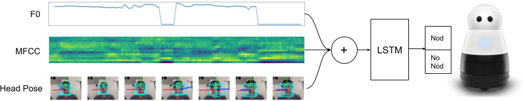

# Learning Backchanneling Behaviors for a Social Robot via Data Augmentation from Human-Human Conversations

[Learning Backchanneling Behaviors for a Social Robot via Data Augmentation from Human-Human Conversations](https://openreview.net/pdf?id=0WDtVJVwBcf)<br />
Michael Murray, Nick Walker, Amal Nanavati, Patricia Alves-Oliveira, Nikita Filippov, Allison Sauppe, Bilge Mutlu, and Maya Cakmak<br />



## Installation

Initialize git sub-modules:
```
$ git submodule update --init --recursive
```

Download the requirements (tested with Python 3.8.5):
```
$ pip install -r requirements.txt
```

Head pose feature generation also requires downloading a pretrained face landmark prediction model (http://dlib.net/files/shape_predictor_68_face_landmarks.dat.bz2) and extracting it into the `active_listening/feature_extraction` directory:

```
$ wget http://dlib.net/files/shape_predictor_68_face_landmarks.dat.bz2
$ bzip2 -d shape_predictor_68_face_landmarks.dat.bz2
$ mv shape_predictor_68_face_landmarks.dat active_listening/feature_extraction/
```

## Data Preparation

The feature extraction and training scripts work on video-based dyadic conversation datasets. The expected format is a directory of mp4 video files where each video is of a distinct interaction with a single speaker. Accompanying each mp4 video file is an  [ANVIL](https://www.anvil-software.org/) annotation file indicating when the listener nodded during the interaction. Additionally, the directory should contain an `index.csv` file with rows for each interaction and three columns: 

- `interaction_id` - where `{interaction_id}_s.mp4` is the name of a video file of the speaker during the interaction.
- `speaker_id` - a unique integer ID for the speaker in the interaction
- `listener_id` - a unique integer ID for the listener in the interaction

### Preprocessing Videos

For each `{interaction_id}_s.mp4` file there should be an accompanying `{interaction_id}_s.wav` file.

We provide the `scripts/preprocess_video.sh` script to automatically extract a .wav file from each .mp4 file in your data directory.

### Annotating Videos

For each `{interaction_id}_s.mp4` file there should be an accompanying `{interaction_id}_l.anvil` [ANVIL](https://www.anvil-software.org/) annotation file which contains 

The annotation file requires only a single track named `nod`. Each element in the track should have a `start` and `end` attribute indicating the start and end times of each nod in the video. The annotation file can also optionally contain a track named `session` indicating the start and end times of the relevant interaction in the video.

We provide the `scripts/convert_elan_to_anvil.py` script to convert annotations created using the [ELAN](https://archive.mpi.nl/tla/elan) tool to the anvil annotations that the rest of the scripts expect.


## Feature Extraction and Augmentation

To extract features from your dataset for training we provide the `scripts/generate_features.py` script:
```
python scripts/generate_features.py --data ./data --output ./data
```

The script can also be used to generate an augmented dataset by passing features to the `--augmentations` or `-a` parameter:
```
python scripts/generate_features.py -a mfcc f0 head_pose --data ./data --output ./data_augmented
```

## Training and Evaluation

To train a model and evaluate on validation folds we provide the `scripts/train_model.py` script:
```
python scripts/train_model.py --data ./data
```

To use one or more generated augmented datasets use the `--augmented-data` parameter:

```
python scripts/train_model.py --data ./data --augmented-data ./data_augmented
```
